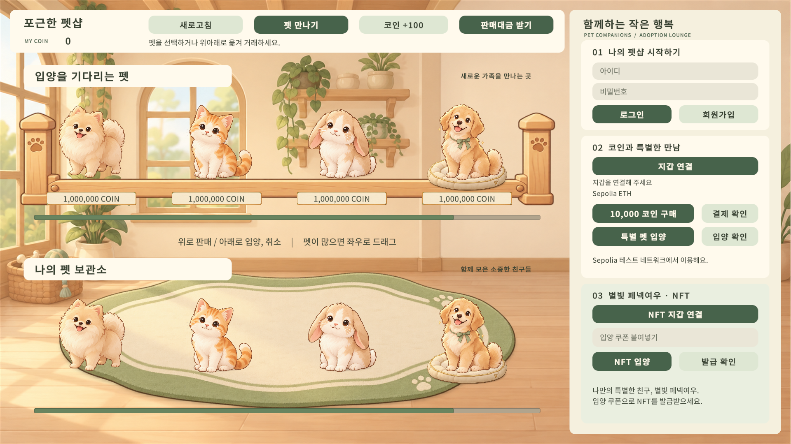
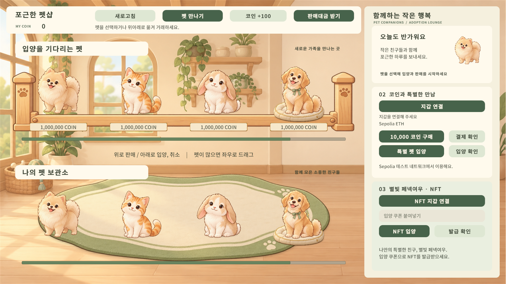
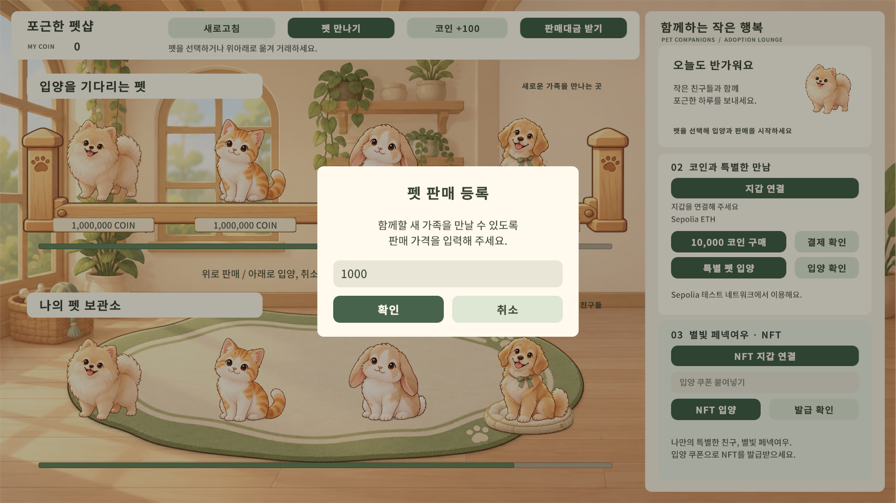

# 포근한 펫샵

Unity 기반 펫 거래소 프로젝트입니다. 펫을 인벤토리에서 확인하고 경매장에 판매 등록하거나 구매할 수 있으며, UGS 계정 인증과 Sepolia 지갑 결제·NFT 연동 기능을 포함합니다.

기존 교육용 거래소 프로젝트를 바탕으로, 펫샵 테마의 화면과 거래 인터랙션을 구성한 개인 프로젝트입니다.

## 화면 미리보기







위 이미지는 UI 검증용 렌더입니다. 표시된 펫과 가격은 샘플 데이터입니다.

## 주요 기능

- **계정 관리**: UGS Authentication 기반 회원가입, 로그인, 로그아웃.
- **펫 인벤토리와 경매장**: 보유 펫 조회, 판매 등록, 매물 구매·취소, 판매대금 정산.
- **거래 인터랙션**: 펫 선택과 드래그, 가격 입력 및 거래 확인창.
- **코인 관리**: 잔액 표시와 거래 후 데이터 갱신.
- **지갑·NFT 연동**: Reown 지갑 연결, Sepolia ETH 결제, NFT 쿠폰 등록·수령 및 인벤토리 동기화.

## 개인 프로젝트에서 개선한 부분

- 원목 배경과 어울리는 크림·세이지 색상의 펫샵 UI 구성.
- 로그인 화면, 로그인 후 환영 카드, 계정·결제·NFT 서비스 영역 정리.
- 상단 브랜드와 코인 표시, 버튼 및 거래 확인창 스타일 통일.
- 한글 TextMeshPro 폰트와 입력칸 여백, 글자 크기 및 넘침 처리 개선.
- 펫 영역의 가로 스크롤과 세로 거래 드래그 구분.
- 드래그 중 자동 갱신으로 조작이 중단되지 않도록 처리.
- 로그아웃 시 코인·펫 목록과 계정 화면 초기화.
- 두 해상도의 UI 렌더와 스크롤·드래그 검증 도구 구성.

세부 변경 내역은 [PETSHOP_UI_UPDATE.md](PETSHOP_UI_UPDATE.md)에 정리했습니다. 인증·거래·결제·NFT의 기반 기능은 원본 프로젝트에서 이어받았습니다.

## 개발 환경

| 항목 | 구성 |
| --- | --- |
| 엔진 | Unity 6 (`6000.3.18f1`) |
| 언어 | C#, Cloud Code JavaScript |
| UI | Unity UI, TextMeshPro |
| 백엔드 | Unity Gaming Services: Authentication, Cloud Save, Cloud Code |
| 지갑 연동 | Reown AppKit Unity `1.7.1`, MetaMask |
| 블록체인 | Ethereum Sepolia 테스트넷 |

## 실행 방법

1. 저장소를 내려받습니다.
2. Unity Hub에서 **`MarketPlaceUGS-main` 폴더**를 프로젝트로 추가합니다.
3. Unity `6000.3.18f1`로 열고 패키지 설치가 완료될 때까지 기다립니다.
4. `Assets/Scene/1.unity` 씬을 열고 Play를 실행합니다.

온라인 기능에는 UGS 프로젝트 연결, 인증 설정, Cloud Code 배포 및 Cloud Save 데이터 구성이 필요합니다. 저장소를 복제하는 것만으로 클라우드 리소스가 생성되지는 않습니다. 서버 코드와 설정 예시는 `MarketPlaceUGS-main/CloudCode/`에서 확인할 수 있습니다.

지갑 결제와 NFT 기능에는 Reown 및 컨트랙트 설정, MetaMask 지갑과 Sepolia 테스트 ETH가 필요합니다. 실제 개인키나 비밀 토큰은 저장소에 넣지 않습니다.

## 폴더 구성

```text
MarketPlaceUGS-main/
├── Assets/
│   ├── Art/PetShop/         # 펫샵 이미지와 UI 자산
│   ├── Editor/              # UI 적용·검증 도구
│   ├── Prefabs/PetShop/     # 펫 표시 프리팹
│   ├── Scene/1.unity        # 메인 씬
│   └── Scripts/             # 인증·거래·지갑·UI 로직
├── CloudCode/               # 서버 코드와 설정 예시
├── Packages/                # Unity 패키지 구성
└── ProjectSettings/         # Unity 프로젝트 설정
UI-Verification/             # UI 검증 이미지와 결과
PETSHOP_UI_UPDATE.md          # UI 개선 기록
```

## UI 검증

저장된 검증 결과에서 1920×1080과 1280×720 해상도, 0·1·4·5·30마리 배치, 가로 스크롤, 마지막 항목 도달, 가로·세로 드래그 분리를 확인했습니다.

Unity 메뉴의 `Tools > Pet Shop > Validate and Capture UI`로 UI 검증을 실행할 수 있습니다. `Apply Polished UI`는 지정된 레이아웃을 다시 적용하므로 수동 배치를 덮어쓸 수 있습니다.

이 기록은 UI 검증 범위입니다. 실제 마우스 입력, 온라인 두 계정 거래, 지갑 결제, NFT 발급 및 WebGL 실행의 종단 검증은 별도로 필요합니다.

## 기반 프로젝트

[ikhong0303/UGSMarketwithSepoliaETH](https://github.com/ikhong0303/UGSMarketwithSepoliaETH)를 기반으로 수정했으며, 원본 커밋 이력을 유지합니다.
